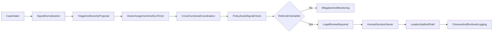
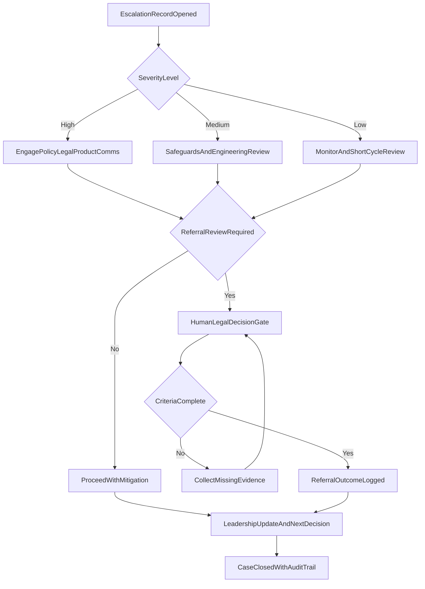

# Enforcement Response Command Center

A polished frontend prototype that demonstrates how an Incident Response Manager can run a high-stakes Trust and Safety enforcement operation with clear on-call ownership, sensitive escalation coordination, and leadership-ready communication.

## What this prototype demonstrates

- Mission Control view for real-time operational posture
- Active escalation console with decision framing and stakeholder alignment
- Decision brief generation for executive communication under pressure
- Runbook and SOP ownership with contextual checklist progress
- Coverage risk visibility and staffing recommendation logic
- Tooling issue triage and engineering follow-up tracking
- Metrics and trend reporting for leadership context
- Automation backlog with impact scoring and maturity roadmap

All incident data is fictional and sanitized.

## Tech stack

- React
- TypeScript
- Vite
- Tailwind CSS
- Lucide React
- Recharts
- Local mock data only (no backend)

## Project structure

- `ui/src/App.tsx` - app shell and section navigation
- `ui/src/screens/` - all command-center screens
- `ui/src/components/` - reusable UI components
- `ui/src/data/mockData.ts` - fictional operational datasets
- `ui/src/data/selectors.ts` - derived metrics and confidence calculations
- `ui/src/types/models.ts` - typed data contracts
- `docs/` - supporting governance and operational artifacts

## Install dependencies

```bash
cd ui
npm install
```

## Run locally

```bash
cd ui
npm run dev
```

Then open the local Vite URL shown in terminal.

## Build for production

```bash
cd ui
npm run build
```

## Demo flow

1. Open **Mission Control** and show on-call owner + coverage confidence.
2. Review active sensitive escalations and leadership summary.
3. Open **Escalations**, filter by severity, and select `ESC-1048`.
4. Walk through Situation, Decision Frame, Stakeholders, Timeline, and Runbook checklist.
5. Open **Decision Brief** and click **Generate Decision Brief**.
6. Use **Copy Brief** to show communication readiness.
7. Open **Coverage** and review gap detector + staffing recommendation.
8. Open **Tooling** and filter issues by severity/status.
9. Open **Metrics** and discuss trend and leadership narrative.
10. Open **Automation** and sort the backlog by impact score.

## Process flow



## Decision tree



### Diagram legend

- **Process flow boxes** represent primary operational stages from intake to closeout.
- **Decision diamonds** represent conditional checkpoints that alter the path.
- **Human decision gate** indicates steps that remain human-owned (especially legal/referral outcomes).
- **Loop back arrows** indicate evidence collection or re-review before proceeding.

## Mapping to job requirements

| Job Requirement                    | Prototype Feature                           |
| ---------------------------------- | ------------------------------------------- |
| Own on-call rotations and coverage | Coverage dashboard and gap detector         |
| Maintain runbooks and SOPs         | Runbook center and contextual checklists    |
| Triage tooling issues              | Tooling health dashboard                    |
| Report on volume and metrics       | Metrics and leadership reporting            |
| Coordinate sensitive escalations   | Active escalation console                   |
| Communicate clearly under pressure | Decision brief generator                    |
| Track referral pathways            | Referral review status and volume dashboard |
| Identify automation opportunities  | Automation backlog                          |
| Improve program maturity           | Program maturity roadmap                    |

## Additional artifacts

This repository also includes Python-based simulation artifacts and governance documents used to seed realistic operations context:

- `scripts/run_demo.py`
- `scripts/run_infractions_simulation.py`
- `outputs/`
- `docs/SECURITY_MODEL.md`
- `docs/GOVERNANCE_CONTROLS.md`
- `docs/MODEL_RISK_REGISTER.md`
